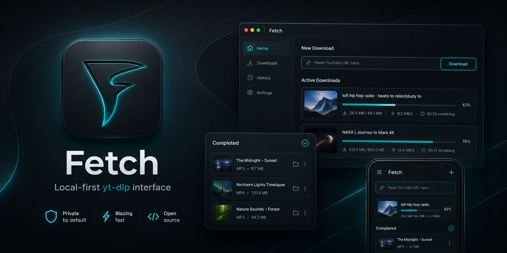

<p align="center">
  
</p>

<h1 align="center">Fetch</h1>

<p align="center">
  A private, local-first, cross-platform downloader interface powered by
  <code>yt-dlp</code> and FFmpeg.
</p>

<p align="center">
  <strong>No cloud · No accounts · No tracking · No transcoding server</strong>
</p>

Fetch turns `yt-dlp` into a focused application that works from a desktop
browser, phone, or tablet. A single Rust process owns the API, downloads,
managed tools, SQLite database, realtime updates, and embedded Vue interface.

## Highlights

- Analyze any URL supported by `yt-dlp`—there is no site-specific scraper code.
- Download video or audio with quality, codec, container, metadata, thumbnail,
  and subtitle controls.
- Queue persistent jobs with real progress, configurable concurrency,
  stop, continuation-based resume, and retry.
- Download playlists into safe ordered folders while keeping standalone media
  directly inside the selected download directory.
- Manage `yt-dlp`, FFmpeg, and FFprobe with checksum verification, health
  checks, atomic updates, rollback, and repair.
- Browse cached artwork and completed files without exposing filesystem paths
  to browser clients.
- Preview browser-compatible media using native playback and HTTP Range
  requests. Unsupported formats remain available through Open and Download.
- Use a responsive desktop/mobile UI with Dark, Light, and system themes.
- Open Fetch on a phone by scanning the LAN QR code instead of typing an IP and
  port.
- Open completed media in the host file manager, download it from remote
  devices, or permanently delete the media while retaining job history.
- Share one realtime SSE connection safely between several open Fetch tabs,
  with visible ownership, takeover, automatic failover, and retry handling.
- Bind locally or to a trusted LAN with a CIDR allow-list.
- Inspect retained process logs and database, runtime, and output diagnostics.

## How it works

| Layer | Technology | Responsibility |
| --- | --- | --- |
| Application | Rust, Tokio | Startup, configuration, process ownership, graceful shutdown |
| HTTP | Axum, SSE | Typed REST API, realtime events, embedded UI, file streaming |
| Downloads | yt-dlp, FFmpeg, FFprobe | Extraction, download, merge, remux, metadata, artwork |
| Storage | SQLite + filesystem | Settings, jobs, history, diagnostics, completed media |
| Interface | Vue 3, TypeScript, Pinia, Tailwind CSS | Responsive localhost and LAN experience |

The production frontend is embedded in the native executable. Node.js is only
needed to develop or build the frontend; it is not a release runtime
dependency.

## Output organization

Fetch keeps downloaded media easy to find while storing private application
artifacts separately:

```text
<download directory>/
├── Standalone video or audio.ext
└── Playlists/
    └── Playlist title [playlist-id]/
        ├── 001 - First item.ext
        └── 002 - Second item.ext

<application data>/
├── data/fetch.sqlite3
├── runtime/
└── thumbnails/
```

## Run a release archive

Extract the archive for your platform and run `fetch` (`fetch.exe` on Windows).
Fetch opens <http://127.0.0.1:8080/> by default and prepares missing managed
runtime components inside the operating system's application-data directory.

The default bind is localhost-only. When LAN access is enabled, every client in
an allowed CIDR can control downloads and access completed files because Fetch
intentionally has no application authentication. Never expose Fetch directly
to the public internet.

## Development

Requirements:

- a stable Rust toolchain;
- Node.js 22 or newer;
- npm.

Start the Rust server and Vite development frontend together:

```bash
cd web
npm ci
cd ..
./scripts/dev.sh
```

Vite runs at <http://127.0.0.1:5173/> and proxies same-origin `/api/...`
requests to Fetch. To build and run the embedded production interface:

```bash
cd web
npm ci
npm run build
cd ..
cargo run --release
```

Run the mandatory local checks with:

```bash
./scripts/check.sh
FETCH_RUN_E2E=1 PLAYWRIGHT_CHROMIUM_EXECUTABLE_PATH=/path/to/chrome ./scripts/check.sh
```

## Configuration

Settings changed in the UI are persisted in SQLite. An optional TOML file can
provide the initial startup values:

```toml
bind_address = "127.0.0.1"
port = 8080
data_directory = "/path/to/fetch-data"
download_directory = "/path/to/downloads"
concurrent_downloads = 3
allowed_networks = ["192.168.0.0/16"]
open_browser_on_start = true
ytdlp_auto_update = true
log_filter = "fetch=info,fetch_server=info"
```

Set `FETCH_CONFIG` to an explicit file. `FETCH_BIND_ADDRESS`, `FETCH_PORT`,
`FETCH_DATA_DIRECTORY`, `FETCH_DOWNLOAD_DIRECTORY`, and `FETCH_LOG` override
their corresponding startup values. Bind and port changes saved in the UI take
effect after restart; CIDR changes take effect immediately.

Appearance remains a browser-local preference so desktop and mobile clients
can independently use Dark, Light, or Use system.

## Scope and security

Fetch is a local utility—not a cloud service, multi-user platform, media server,
transcoding service, or website-specific scraper. It does not provide accounts,
OAuth, pairing codes, public tunnels, router configuration, or cloud storage.

See [Security](docs/SECURITY.md) before enabling LAN access.

## Documentation

- [Architecture](docs/ARCHITECTURE.md)
- [API and SSE events](docs/API.md)
- [Download engine](docs/DOWNLOAD_ENGINE.md)
- [Runtime management](docs/RUNTIME.md)
- [Testing](docs/TESTING.md)
- [Release packaging](docs/RELEASE.md)
- [Acceptance matrix](docs/ACCEPTANCE.md)

Fetch is available under the [MIT License](LICENSE). Managed third-party tools
retain their own licenses; see [Third-party notices](THIRD_PARTY_NOTICES.md).
